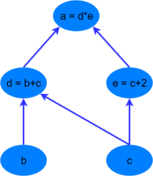
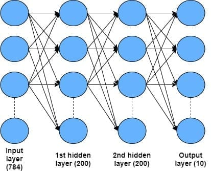
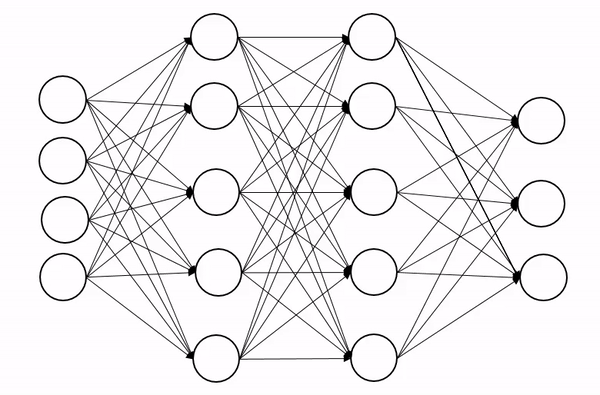

# Изучаем Pytorch

  
  
  
  
  
  

  
  
  

## Учебник Pytorch для начинающих
Если вы пробовали создавать свои собственные глубокие нейронные сети с помощью TensorFlow и Keras, вы, вероятно, 
знакомы с трудностями отладки этих библиотек. Хотя у них есть Python API, все равно сложно понять, что именно пошло 
не так с ошибкой. Они также плохо работают с numpy, scipy, scikit-learn, Cython и другими. Библиотека глубокого 
обучения PyTorch имеет заявленное преимущество в том, что она хорошо работает с Python и создана для апологетов 
Python. Кроме того, приятным свойством PyTorch является построение вычислительного динамического графа, 
противоположного статическим вычислительным графам, представленным в TensorFlow и Keras. PyTorch сейчас находится на 
подъеме и используется в разработке Facebook, Twitter, NVIDIA и другими компаниями.      

## PyTorch — Введение
PyTorch определяется как библиотека машинного обучения с открытым исходным кодом для Python. Он используется для 
таких приложений, как обработка естественного языка. Первоначально он был разработан исследовательской группой 
искусственного интеллекта Facebook и программным обеспечением для вероятностного программирования Uber Pyro, которое 
основано на нем.   

PyTorch изначально был разработан Хью Перкинсом как оболочка Python для LusJIT на основе фреймворка Torch.

PyTorch реконструирует и встраивает Torch в Python, используя те же основные библиотеки C для внутреннего кода. 
Разработчики PyTorch настроили этот внутренний код для эффективной работы с Python. Они также сохранили аппаратное 
ускорение на основе графического процессора, а также функции расширения.   

### Характеристики
Основные функции PyTorch:
- Простой интерфейс — PyTorch предлагает простой в использовании API, поэтому считается, что с Python очень легко 
работать. Запустить код в этой среде довольно просто.
- Использование Python. Эта библиотека легко интегрируется со стеком данных Python. Таким образом, он может 
   использовать все сервисы и функции, предлагаемые средой Python.
- Вычислительные графики. PyTorch предоставляет отличную платформу, которая предлагает динамические вычислительные 
 графики. Таким образом, пользователь может изменить их во время выполнения. Это очень полезно, когда разработчик 
  не знает, сколько памяти требуется для создания модели нейронной сети.

PyTorch известен тем, что имеет три уровня абстракции, как указано ниже:
- Тензор — это императивный n-мерный массив, работающий на графическом процессоре.
- Переменная — это узел вычислительного графа. Это хранит данные и градиент.
- Модуль — уровень нейросети, в котором будут храниться данные о состоянии или изучаемых весах.

### Преимущества PyTorch
Ниже приведены преимущества PyTorch:

- Код легко отлаживать и понимать.
- Он включает в себя множество слоев, как и факел.
- Включает множество функций потерь.
- Его можно рассматривать как расширение NumPy для графических процессоров.
- Это позволяет строить сети, структура которых зависит от самих расчетов.

### Вычислительные графики
Первое, что нужно понять о любой библиотеке глубокого обучения, — это идея вычислительных графов. Вычислительный 
граф — это набор вычислений, называемых узлами, которые связаны в прямом вычислительном порядке. Другими словами, 
выбранный узел зависит от узлов во входных данных, которые, в свою очередь, выполняют вычисления для других узлов. 
Ниже приведен простой пример вычислительного графа для вычисления выражения a = (b + c) * (c + 2). 

Преимущество использования вычислительного графа в том, что каждый узел является независимым функционирующим 
фрагментом кода, если он получает все необходимые входные данные. Это позволяет оптимизировать производительность 
при выполнении расчетов с использованием многоканальной обработки, параллельных вычислений. Все основные фреймворки 
глубокого обучения (TensorFlow, Theano, PyTorch и т. д.) включают конструкции вычислительного графа, которые 
выполняют операции внутри нейронных сетей и обратно распространяют градиент ошибок. 

### Тензоры
Тензоры — это матричные структуры данных, которые являются неотъемлемыми компонентами библиотек глубокого обучения и 
используются для эффективных вычислений. Графические процессоры (GPU) эффективно выполняют вычислительные операции 
между тензорами, что породило волну возможностей в области глубокого обучения. 

Более детально тензоры можно изучить в [Знакомство с тензорами](https://github.com/BEPb/pytorch_tutorial/01_основы/01_tensor.py) и 
[базовые математические операции](https://github.com/BEPb/pytorch_tutorial/01_основы/02_BasicMath.py).

### Автоматическое дифференцирование в PyTorch
В библиотеках глубокого обучения есть механизмы для вычисления градиента ошибки и обратного распространения ошибки 
через вычислительный граф. Этот механизм, называемый автоградиентом в PyTorch, легко доступен и интуитивно понятен. 
Класс переменных является основным компонентом системы автоградиентов в PyTorch. Класс переменных оборачивает тензор 
и позволяет автоматически вычислять градиент тензора при вызове функции .backward(). Объект содержит данные из 
тензора, градиент тензора (вычисленный один раз относительно какого-либо другого значения, потери), а также содержит 
ссылку на любую функцию, созданную переменной (если это функция, созданная пользователем, ссылка будет пуста). 

Более детально можно изучить [автоматический градиент](https://github.com/BEPb/pytorch_tutorial/01_основы/03_gradient.py).

Мы изучили простейшие операции с тензорами, переменными и функцией автоградиента в PyTorch. Теперь приступим к 
написанию простой нейронной сети на PyTorch, которая в будущем станет демонстрацией этих функций.

### Создание нейронной сети в PyTorch
[Здесь](https://github.com/BEPb/pytorch_tutorial/01_основы/04_simple_neural_network.py) мы создадим простую нейронную сеть с 4 слоями, включая входной слой и два скрытых слоя. Архитектура, которую 
мы будем использовать, показана на картинке, с одной оговоркой, количество нейронов в каждом слое будет разным:

Входной слой состоит из 8 нейронов, которые составляют входные данные в наборе данных. Затем входные данные 
передаются через два скрытых слоя, каждый из которых содержит 512 узлов, с использованием функции активации 
линейного выпрямителя (ReLU). Наконец, у нас есть выходной слой с двумя узлами, соответствующими результату.  Для 
такой задачи классификации мы будем использовать выходной слой softmax.   

### Класс для построения нейронной сети
Для создания нейросети в PyTorch используется класс nn.Module. Для его использования необходимо наследование, 
которое позволит использовать весь функционал базового класса nn.Module, но при этом еще возможно переписать базовый 
класс для построения модели или прямого прохождения по сети. 

### Что такое Dropout (обнуление, отсев или отброс)?
Dropout — это метод машинного обучения, при котором вы удаляете (или «исключаете») модули в нейронной сети, чтобы 
имитировать одновременное обучение большого количества архитектур. Важно отметить, что отсев может значительно 
снизить вероятность переобучения во время тренировки.  

Добавление отсева в ваши модели PyTorch очень просто с помощью класса torch.nn.Dropout, который принимает в качестве 
параметра скорость отсева — вероятность деактивации нейрона. Мы можем применить отсев после любого невыводимого слоя.  

#### 1. Основы
* [Основы PyTorch](https://github.com/BEPb/pytorch_tutorial/01_основы/README.py)
    - [Знакомство с тензорами](https://github.com/BEPb/pytorch_tutorial/blob/master/01_%D0%BE%D1%81%D0%BD%D0%BE%D0%B2%D1%8B/01_tensor.py)
    - [Базовые математические операции](https://github.com/BEPb/pytorch_tutorial/blob/master/01_%D0%BE%D1%81%D0%BD%D0%BE%D0%B2%D1%8B/02_BasicMath.py)
    - [автоматический градиент](https://github.com/BEPb/pytorch_tutorial/blob/master/01_%D0%BE%D1%81%D0%BD%D0%BE%D0%B2%D1%8B/03_gradient.py)
    - [простая нейронная сеть](https://github.com/BEPb/pytorch_tutorial/blob/master/01_%D0%BE%D1%81%D0%BD%D0%BE%D0%B2%D1%8B/04_simple_neural_network.py)
    - [чтение и сохранение модели](https://github.com/BEPb/pytorch_tutorial/blob/master/01_%D0%BE%D1%81%D0%BD%D0%BE%D0%B2%D1%8B/05_model.py)
    - [линейная регрессия](https://github.com/BEPb/pytorch_tutorial/blob/master/01_%D0%BE%D1%81%D0%BD%D0%BE%D0%B2%D1%8B/06_linear.py)
    - [логистическая регрессия](https://github.com/BEPb/pytorch_tutorial/blob/master/01_%D0%BE%D1%81%D0%BD%D0%BE%D0%B2%D1%8B/07_logistic.py)
    - [нейронная сеть с прямой связью](https://github.com/BEPb/pytorch_tutorial/blob/master/01_%D0%BE%D1%81%D0%BD%D0%BE%D0%B2%D1%8B/08_feedforward.py)
  
____
